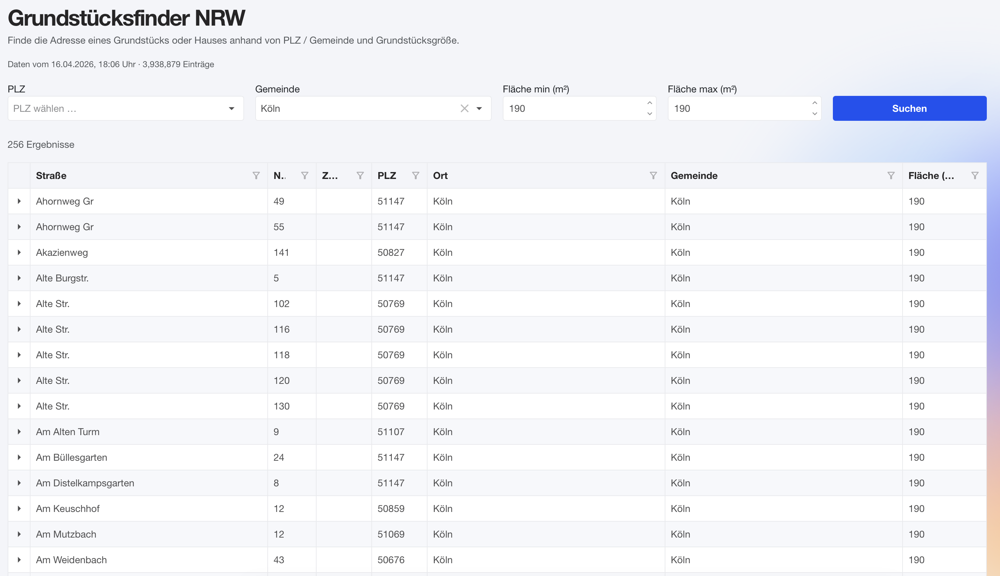

# Grundstücksfinder

Grundstücksfinder is a self-hosted search tool for German real-estate parcels. It imports
official open data ("Grundsteuer") published by German states, stores it in
Postgres, and lets you search parcels by postal code, municipality, and area (m²) through a
Blazor Server web UI — with geocoded map markers via OpenStreetMap/Nominatim.

Currently ships with an importer for **North Rhine-Westphalia (NRW)**. The import pipeline is
built around a pluggable `IPropertyImporter` interface, so adding another Bundesland (or
country) is a matter of writing one importer class — no changes to the shared import,
storage, or search code required.



## Features

- Search parcels by PLZ, Gemeinde, and min/max area
- Map view with geocoded markers (Nominatim, cached to respect its usage policy)
- Automatic daily import of new open-data releases, deduplicated per dataset/file/version
- Multiple data sources can coexist without one import wiping another's rows
- Import history (`ImportLog`) shown per source

## Quick setup

### Run it (Docker Compose)

Requires Docker and a `web` external network for Traefik (or drop the Traefik labels/network
in `docker-compose.yml` if you don't use it).

1. Copy the env template and fill in real values:

   ```bash
   cp .env.example .env
   ```

   | Variable | Meaning |
   |---|---|
   | `DB_PASSWORD` | Password for the `homelocator` Postgres user, shared by `app` and `db` |
   | `DOMAIN` | Public hostname Traefik should route to this app |
   | `GITHUB_REPOSITORY_OWNER` | GitHub user/org owning the `ghcr.io/<owner>/grundstuecksfinder` image |

2. Start it:

   ```bash
   docker compose up -d
   ```

   The app listens on port `8080` behind Traefik and connects to the bundled `postgres:17-alpine`
   service. On first startup it downloads and imports the current NRW dataset (this can take a
   few minutes); the daily import check then runs at 03:00 UTC.

### Local development

`docker-compose.dev.yml` only starts a local Postgres instance (hardcoded dev password, no
`.env` needed):

```bash
docker compose -f docker-compose.dev.yml up -d
cd Grundstuecksfinder
dotnet run --project Grundstuecksfinder
```

Config for local dev lives in `Grundstuecksfinder/appsettings.Development.json`
(`ConnectionStrings:DefaultConnection`, `Import:Nrw:*`). To skip waiting on the real NRW
download while developing, set `EnableDevSeeding` to `true` (in `launchSettings.json` or as an
environment variable) — this seeds a handful of fake parcels from `part.csv` (or a single
hardcoded fallback row) instead of hitting the network.

### Adding another region's importer

Implement `IPropertyImporter` (see `Services/Importers/Nrw/NrwPropertyImporter.cs` for a
CSV-based example) and register it in `Program.cs`:

```csharp
builder.Services.AddScoped<IPropertyImporter, YourRegionPropertyImporter>();
```

The shared `ImportOrchestrator`/`PropertyBulkWriter` handle dataset dedup, per-source deletes,
and the Postgres bulk write — your importer only needs to know how to discover and fetch its
region's data.

## Running tests

Integration tests spin up Postgres via Testcontainers, so Docker must be running:

```bash
dotnet test --project Grundstuecksfinder.Tests
```

## License

Licensed under the [GNU Affero General Public License v3.0](LICENSE) (AGPL-3.0-or-later).
